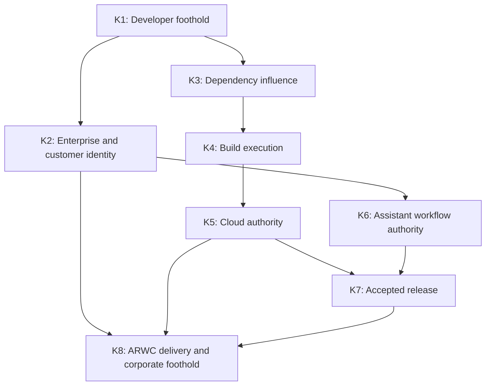
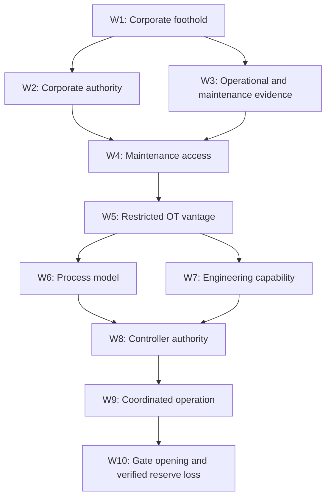

# Cinder Typhoon challenge architecture

Status: first research-backed design proposal, September 18, 2026. Allocation and
timing targets are provisional; no new challenges have been implemented or
playtested. This document specifies participant work and progression before
choosing topology, products, hosts, or deployment size.

Read alongside the [research and Polaris reconciliation](research.md),
[operation portfolio](operation-portfolio-v1.md), and [calibration plan](calibration-v1.md).

## 1. Design position

Build one campaign with a low entry barrier, a substantial middle, and a very
high ceiling. Approximately 300 people play individually, with a provided agent
and optional bring-your-own agents, for approximately sixteen hours over two
days. Some have never hacked; some operate at the highest professional level.
Agents belong inside the difficulty model from the beginning.

The recommendation is a **240-challenge allocation**, within a **220–280 planning
range**, across three phases. This is a content budget, not a claim that 240
finished challenge designs exist. It expands the user's over-50-challenge,
three-to-four-hour Polaris baseline while reserving much more substantial upper
tier work. The count must survive a marginal-work review and assisted playtests.
There is no defensible universal AI speed multiplier; see the research.

The campaign has an earned ending. It does not promise every participant entry
to ARWC or completion of the reservoir objective. A first-time hacker should
nevertheless have a real start, understandable progress, and enough accessible
work to keep learning. An elite operator should find difficult work before the
last hour and enough unresolved depth to occupy the event.

Preserve Polaris's progression: discover, gain narrow access, explore new
opportunities, combine branches, and overcome a more demanding boundary. After
a difficult pivot, allow some quick rewards before the next escalation. Avoid
making every successive flag a harder single blocker.

## 2. Units of content

These units prevent both undercounting and padding:

| Unit | Meaning | Example |
| --- | --- | --- |
| Challenge | A scored achievement requiring a distinct inference, access capability, or demonstrated effect. | Establish a usable identity under the correct scope. |
| Operation | A coherent piece of hacking, usually containing several challenges with meaningful partial credit. | Move from a build identity to a usable release capability. |
| Mission family | Several related operations with a narrative purpose and some choice of approach. | Compromise KeplerOps release engineering. |
| Phase | A major change of setting and operational purpose. | Supplier compromise becomes an intrusion into ARWC. |

The worksheet reserves **71 operations**: four training boxes, 32 KeplerOps
operations, and 35 ARWC operations. Those contain the 240 challenge slots.
Operations, not machines, are the principal authoring and playtesting unit.
One operation may span several systems, and several operations may share a
credible business service.

Each scored achievement must add something. Finding an identity, proving its
scope, and overcoming a separate delegation boundary may justify separate
challenges. Reading three fields in the same recovered file does not. Neither
does awarding a second flag for describing an effect already scored.

Reading and analysis can be substantive: reconstructing the correct release
lineage from conflicting evidence is legitimate work. A flag beside an obvious
answer is appropriate for some early wins, not the main source of capacity.

## 3. Progressive difficulty with agents

Difficulty describes the work remaining **after prerequisites are earned**,
using the event's actual provided agent. A late challenge is not elite merely
because the route to reach it was long.

| Tier | Participant work | Typical agent contribution | Design failure to avoid |
| --- | --- | --- | --- |
| Foundation (F) | Follow a clear lead, ask for useful help, execute a bounded task, verify its effect. | Explain unfamiliar concepts; inspect artifacts; perform routine tool use. | Tool installation or command memorization becomes the obstacle. |
| Applied (I) | Choose among plausible leads and adapt a familiar technique to the observed environment. | Enumerate, generate a small tool, interpret an error, compare evidence. | Copying one generic prompt produces every achievement in a family. |
| Advanced (A) | Combine identities, artifacts, or weaknesses across a real boundary; debug an incomplete approach. | Parallel analysis and implementation, with the player maintaining the operation's model. | One exposed superuser credential collapses the whole chain. |
| Expert (X) | Develop an unfamiliar chain or exploit, resolve contradictory observations, and make it reliable. | Source analysis, experiments, exploit construction, protocol tooling. | Difficulty comes mostly from missing documentation or random failures. |
| Elite (E) | Discover and operationalize a non-obvious weakness or compose several demanding capabilities under meaningful constraints. | Substantial autonomous research and tooling, with human judgment and/or sophisticated orchestration. | An elaborate description conceals a standard one-step exploit. |

These are hypotheses until tested. Job title is not a tier assignment. A novice
may have excellent agent fluency; an experienced practitioner may encounter an
unfamiliar domain. Players choose work from their earned position rather than
being placed into permanent skill tracks.

### Allocation

| Phase | Challenges | F | I | A | X | E |
| --- | ---: | ---: | ---: | ---: | ---: | ---: |
| 1: Cinder Typhoon training | 16 | 12 | 4 | 0 | 0 | 0 |
| 2: KeplerOps Software | 104 | 20 | 44 | 28 | 10 | 2 |
| 3: Alterra Regional Water Company | 120 | 4 | 24 | 48 | 32 | 12 |
| **Total** | **240** | **36** | **72** | **76** | **42** | **14** |

Thus 108 slots establish and exercise fundamentals, 76 require advanced work,
and 56 are reserved for expert or elite work. These are allocations to fill
with defensible tasks, not difficulty labels to apply after writing easy tasks.
The late phase is predominantly advanced and above. Its few foundation rewards
occur near the corporate entry, after the supplier gate has been earned.

## 4. Phase 1: Learn to operate with an agent

The training network consists of **four small jeopardy boxes**, four challenges
each. The story is Cinder Typhoon preparing operators for an already-established
KeplerOps foothold. Training should teach a useful operating loop:

1. Establish what is actually known.
2. Give the agent an objective, relevant evidence, and the current access scope.
3. Inspect the result and distinguish observations from suggestions.
4. Verify the effect and save the useful state for the next task.

| Box | Allocation | Work and transfer into the campaign |
| --- | --- | --- |
| T1: Operator workbench | 4 F | Recover an exposed local artifact; find a separate resource from a supplied web clue; exercise a provided scoped credential; resolve an incorrect client report using actual service state. |
| T2: Accounts and applications | 3 F, 1 I | Explore an application, recover a useful clue, establish access, and distinguish that identity's rights from a more privileged one. |
| T3: Developer residue | 3 F, 1 I | Inspect a repository and package artifact; recover a synthetic credential; use it successfully under its actual scope. |
| T4: State and evidence | 2 F, 2 I | Read a small simulated device/service; adapt a client; change an allowed state; verify the resulting state independently. |

Initial target: first meaningful flag within ten minutes of a working session,
with several early successes within thirty minutes. This is a test criterion,
not a forecast from published AI studies. A novice should be able to spend
45–90 minutes here productively. A fluent operator should be able to demonstrate
readiness and move on in roughly 10–20 minutes, or go directly to KeplerOps.

Training is recommended and always revisitable. Completing all sixteen flags
is not required for Phase 2. The launch workflow checks access to the workbench
and provides the story briefing; it does not hold experienced players behind a
quiz. The harder T3/T4 items offer optional preparation for later mechanics.

Workbench login, sending a prompt, and submitting an already-recovered flag are
onboarding steps, not additional challenge counts. Each T1 achievement uses a
distinct small task while practicing the same operating loop.

## 5. Phase 2: Turn a developer foothold into supplier authority

The player starts on the compromised developer workstation. The opening
package-install compromise is established story state, not an extra unannounced
initial-access exam. The first question is what that foothold can legitimately
reach, and how to turn its limited privileges into a supplier compromise.

The inspiration is the movement from package execution into developer secrets,
repository and workflow authority, and further distribution documented in
the [Shai-Hulud investigation](https://www.wiz.io/blog/shai-hulud-npm-supply-chain-attack).
The fictional attack remains inside the event's services. KeplerOps must feel
like a software company with working development, support, release, and customer
processes, rather than a warehouse of unrelated credentials.

| Family | Operations | Challenges | F | I | A | X | E | Purpose |
| --- | ---: | ---: | ---: | ---: | ---: | ---: | ---: | --- |
| K1: Borrowed desk | 4 | 12 | 8 | 4 | 0 | 0 | 0 | Understand the foothold and recover usable, limited access. |
| K2: Whose identity? | 4 | 12 | 5 | 5 | 2 | 0 | 0 | Cross enterprise identity boundaries and identify customer relationships. |
| K3: Dependency conveyor | 4 | 14 | 3 | 7 | 4 | 0 | 0 | Move from package artifacts to registry and repository trust. |
| K4: Build service | 5 | 16 | 2 | 7 | 5 | 2 | 0 | Turn development influence into controlled build execution. |
| K5: Cloud delegation | 4 | 14 | 1 | 6 | 5 | 2 | 0 | Establish scoped workload identities and reach release/customer services. |
| K6: Assistant authority | 4 | 12 | 1 | 5 | 4 | 2 | 0 | Exploit the trust relationships of an internal AI-enabled workflow. |
| K7: Release engineering | 4 | 14 | 0 | 6 | 5 | 2 | 1 | Produce an altered release accepted through the supplier's real workflow. |
| K8: Customer bridge | 3 | 10 | 0 | 4 | 3 | 2 | 1 | Bind that release to the correct ARWC tenant and gain a corporate foothold. |
| **KeplerOps total** | **32** | **104** | **20** | **44** | **28** | **10** | **2** | |

### Access and convergence

This is a capability dependency map, not a network diagram. Converging arrows
mean that the next operation needs the different upstream capabilities; they
do not require completing every optional challenge in each family.

The initial desk exposes both enterprise and developer leads. K2 and K3 can be
pursued independently. K3 opens K4; K4 exposes the workload identities used in
K5. K2 provides the business and support context needed to investigate K6.

K5 and K6 contribute different capabilities to K7: a technical release path
and authority within the release/support workflow. K6's output must be a real
capability with observable scope, not a magic phrase supplied by a chatbot.
Where AI behavior is part of the required route, it must meet the reproducibility
criteria in the calibration plan.

K8 joins the accepted release with the ARWC customer identity and configuration
discovered through K2/K5. Its success is normal customer-side consumption of the
player's altered release, resulting in a **limited ARWC corporate foothold**.
It does not directly grant OT access.

The design must therefore distinguish three things that generic credential
hunts often collapse:

- Knowing the customer and correct deployment context.
- Possessing usable authority for that customer's delivery workflow.
- Supplying an artifact that passes the workflow and has the intended effect
  when the customer actually consumes it.

The Phase 2 gate is that last demonstrated effect. Points or a collection of
unrelated flags cannot substitute for it. Alternative discoveries that achieve
the same authorized range effect are valid; players need not reproduce the
author's exact command sequence.

## 6. Phase 3: From corporate access to physical process authority

ARWC initially looks like a water company's corporate environment: customer and
contractor identities, operational data, maintenance scheduling, engineering
records, and a limited supplier integration. The player's supplier compromise
creates opportunity without making every trust boundary disappear.

| Family | Operations | Challenges | F | I | A | X | E | Purpose |
| --- | ---: | ---: | ---: | ---: | ---: | ---: | ---: | --- |
| W1: Supplier footprint | 3 | 10 | 3 | 5 | 2 | 0 | 0 | Establish what the new corporate access can do. |
| W2: Corporate identity | 4 | 14 | 1 | 7 | 5 | 1 | 0 | Cross application, service, and directory authority boundaries. |
| W3: Data operations | 4 | 12 | 0 | 5 | 5 | 2 | 0 | Reconstruct asset, maintenance, and water-allocation relationships. |
| W4: Maintenance trust | 4 | 14 | 0 | 3 | 7 | 4 | 0 | Convert corporate privileges and process knowledge into maintenance access. |
| W5: OT vantage | 3 | 10 | 0 | 2 | 5 | 3 | 0 | Establish restricted OT visibility and recognize remaining boundaries. |
| W6: Process truth | 4 | 14 | 0 | 1 | 7 | 5 | 1 | Infer the actual process from engineering material and live observations. |
| W7: Engineering workbench | 4 | 14 | 0 | 1 | 7 | 5 | 1 | Recover engineering capabilities and analyze the control interface. |
| W8: Controller authority | 3 | 12 | 0 | 0 | 5 | 5 | 2 | Obtain usable control under the correct identity, mode, and session state. |
| W9: Coordinated release | 3 | 10 | 0 | 0 | 3 | 4 | 3 | Compose the required authorities into a reliable process operation. |
| W10: Open gates | 3 | 10 | 0 | 0 | 2 | 3 | 5 | Execute the campaign objective; offer demanding variants and additional depth. |
| **ARWC total** | **35** | **120** | **4** | **24** | **48** | **32** | **12** | |

### Access and convergence

W1 exposes identity and data leads. W2 and W3 supply different prerequisites
for W4: usable authority and knowledge of the relevant maintenance relationship.
W4 opens W5's restricted OT vantage. That permits both process investigation
(W6) and engineering access/tooling (W7). Those branches converge at W8.

W9 combines W8's controller authority with the process model from W6 and the
engineering capability from W7. W10 requires the resulting operation to work
against the actual process state. There are several places to investigate,
but the causal boundaries remain intact.

Distinct achievements include reaching a service, reading its state, acquiring
write authority, acquiring control in the relevant operating mode, and causing
the intended process effect. A reachable industrial port must not imply all
five achievements. Likewise, domain compromise must not hand over controller
authority without further work.

### Final narrative and success condition

The proposed physical fiction is a reservoir release into an engineered
receiving basin or other controlled receiving system. The release reduces
usable reserves during the scenario's operating period. ARWC incurs replacement
water costs and imposes water restrictions. The fictional process should explain
why that water cannot simply be restored to usable inventory immediately.

This is a **proposed process model**, pending water/OT subject-matter review.
The final design must support those consequences without implying flooding,
contamination, loss of life, or catastrophic infrastructure damage.

Campaign completion requires independent process evidence that the correct
gates opened and the defined reserve-loss condition occurred. A dashboard
message, accepted command, changed display tag, or collected final password is
insufficient by itself. The evaluator observes the simulated process separately
from the interface the player compromises.

The earned finale includes at least one elite-level synthesis challenge. The
other elite slots in W10 support optional harder variants or additional distinct
operations; all five are not mandatory serial gates. Finishing the story does
not erase access to unresolved operations elsewhere in the campaign.

## 7. Choice without flattening progression

At each earned stage, aim for two or three useful open leads, including a way
to consolidate a recent gain and a route toward the next boundary. Open leads
are actual solvable work, not twenty locked cards on a scoreboard.

An individual can pursue them sequentially or delegate independent investigations
to their agents. No operation depends on another human player being present,
solving a complementary role, or opening a shared world gate.

Optional depth should do at least one of these things:

- Expose a distinct weakness or a different useful capability.
- Offer a comparably demanding alternate route around a specialization barrier.
- Give better observability, a more reliable technique, or an operational advantage.
- Reward a deeper compromise without being necessary to reach the next phase.

Optional does not mean irrelevant. A better artifact inventory might reduce
later search work; a second identity might simplify recovery. Essential facts
cannot be hidden exclusively in a branch advertised as optional. If a branch
supplies a required capability, its full dependency cost belongs to the route.

Use a provisional reference-route budget of **68 campaign milestones**: 30 in
KeplerOps and 38 in ARWC, plus up to four short training readiness achievements.
That leaves substantial optional work while putting real difficulty on the
route to the ending. These are authoring budgets, not yet an enumerated or
validated shortest path. Dependency closure must be checked when individual
challenge briefs are written.

Never unlock later phases globally because the first player succeeds. Never
open the reservoir objective automatically on the second morning. Later access
is earned per player. If a required challenge fails technically, repair it and
apply a documented, consistent compensation rule; do not disguise a broken
challenge as intended difficulty.

## 8. Sixteen-hour pacing

The event has one continuous progression across two days, not a synchronized
Phase 2 morning and Phase 3 afternoon. The following are **design trajectories
to test**, not attendance forecasts or fixed schedules:

| Player-agent profile | Opening | Middle of the event | Later play |
| --- | --- | --- | --- |
| First-time hacker | Early flags and a usable agent workflow; training can take 45–90 minutes. | Meaningful KeplerOps operations, revisiting techniques and following successful pivots. | Continued supplier work, deeper branches, or ARWC entry if their progress supports it. Completion is not required. |
| Practicing generalist | Brief orientation and prompt entry into KeplerOps. | Several supplier trust boundaries; ARWC entry is a credible target. | Corporate/OT progression, advanced side work, and a possible attempt at the ending. |
| Elite operator with a strong agent workflow | Minimal training; rapid traversal of routine work. | Early access to expert supplier branches and demanding ARWC work. | A serious finale attempt plus unresolved expert/elite operations. Clearing the entire portfolio should remain exceptional. |

For route testing, begin with an **8–12-hour elite main-route hypothesis** and
an **11–15-hour strong-generalist hypothesis**, including normal discovery but
excluding breaks and service outages. These overlap deliberately and must be
replaced with measured ranges. An elite player finishing the story before hour
six is a warning that the route may be too shallow; an author taking sixteen
hours is not evidence it is appropriately hard.

The catalog is larger than any expected individual's route. The question is
whether a player still has worthwhile accessible work, not whether every person
has seen every card. Experts need optional depth accessible well before the
finale; novices need enough real work before the first severe boundary.

After demanding operations, provide short consolidation rewards and a clearer
new situation. Reveal ARWC's relationship to KeplerOps early, the deployment
mechanism through investigation, and the reservoir purpose through corporate
and operational evidence. Narrative should become more specific as access grows.

Long stalls are diagnostic signals, not automatic reasons to lower difficulty.
Distinguish deliberate research from having no plausible action. Hint telemetry
and floor support should detect the latter.

At the overnight boundary, preserve earned access, challenge state, and the
player's case notes. Provide a concise resume view with verified capabilities,
open leads, and the last attempted operation. Pause participant-triggered process
timers when official play is closed; no unattended overnight depletion should
change a person's story. The sixteen-hour budget must not quietly become a
forty-eight-hour always-running agent competition.

## 9. Agents, information, hints, and scoring

### Agent use

The provided agent must support real tool use and context retention. Teach it as
a collaborator capable of explanation, investigation, implementation, and
verification. Do not force people to type commands manually after their agent
has found a valid solution.

The player's agent and KeplerOps' vulnerable in-story assistant are different
systems with different trust boundaries. Make this distinction clear in the
story and workbench. Keep grading data, flags, and author solutions out of both
agents' ordinary accessible context.

Allow BYO workflows under the same target-access and request-rate rules. A
common provided capability is a minimum participation baseline, not a claim of
identical compute or model performance. Do not attempt to equalize performance
through arbitrary prompt or tool restrictions. Benchmark the stronger workflows
so that routine parallel extraction cannot empty the content portfolio.

### Information and hints

Use layered assistance:

1. Free orientation: interface use, agent use, scope, reset behavior, and what
   kind of achievement a challenge recognizes.
2. Discovery hints: point toward relevant evidence or a neglected relationship.
3. Mechanism hints: explain the boundary or technical concept that matters.

Recommended default: these hints are available on request without score
penalties. They should restore productive work while leaving a real task to do.
They do not escalate into a complete final exploit or control sequence. A
solution walkthrough belongs after the competition. Record hint use for
calibration, not to penalize participants for using the intended learning support.

Advanced prompts name the operational objective and observable success without
spelling out the vulnerability. Relevant documentation is discoverable. No
challenge depends on a typo, an unknowable magic value, or guessing what answer
format the author wanted.

### Scoring and evidence

Use one individual scoreboard with both score and campaign progress visible.
Avoid mandatory self-identification as beginner or elite. Show personal progress
prominently so that a low global rank does not hide substantial achievements.

Begin score calibration with fixed relative weights **1:2:4:8:16** across
F/I/A/X/E. These are tuning weights, not final published point values. Simulate
whether they reward substantive depth while retaining early progress. Avoid
retroactive dynamic decay until its effect on this individual, sequential
campaign is understood. No points for using or avoiding an agent.

The campaign completion marker is separate from total score: a specialist can
earn a high score without finishing the story, and a route-focused finisher
may leave many challenges unsolved. Publish that relationship clearly.

Prefer automatic validation of range effects or player-specific evidence.
Validate the capability exercised and outcome, not a prescribed exploit string.
Reject generic flags copied from another player's instance. Administrative
access to one workload must not reveal a directory containing the remaining
answers. Avoid required essays or manual grading of 300 agent transcripts.

## 10. Requirements imposed on the eventual range

These are consequences of the challenge architecture, not topology decisions:

- Every player has independent mutable identities, release state, progression,
  and process state. One player's exploit or reset cannot change another's task.
- Shared immutable artifacts are acceptable. A shared mutable controller or
  exclusive lab station cannot be on 300 individuals' mandatory path.
- Reset a failed operation to a useful earned checkpoint without erasing the
  campaign. Reset semantics must close replay and score-duplication bugs.
- Critical effects have independent evaluators. Tests include plausible wrong
  effects, partial success, and agent-reported success with no actual change.
- Critical stateful tasks are repeatable on demand. A real-time race must be
  technically meaningful and reproducible, not a contest against conference Wi-Fi.
- Agent queues, target saturation, model errors, and reset failures are measured
  separately from challenge solve time. Service shortages cannot supply the
  missing hours of content.
- The challenge board offers a coherent view of the current mission and open
  leads. It does not dump 240 unrelated cards on a newcomer or hide all remaining
  content behind a single unexplained lock.

## 11. Decisions this proposal makes, and what remains to prove

The proposed architecture commits to one progressively harder campaign,
individual progression, agent-enabled calibration, causal phase gates, a large
portfolio with substantial expert depth, and independent proof of the final
process effect. It gives the supplier and water-company phases distinct work
while making the first causally necessary to the second.

The allocation, route budgets, score weights, and timing envelopes remain
revisable design hypotheses. The exact weaknesses, final per-challenge catalog,
verified process model, measured elite difficulty, and authoring/support effort
remain to be established. The [portfolio](operation-portfolio-v1.md) makes the
proposed operations reviewable; the [calibration plan](calibration-v1.md) defines
what would justify accepting them.

Topology should follow those outcomes and dependencies. Host counts, networks,
products, and cloud shape are intentionally not chosen here.
