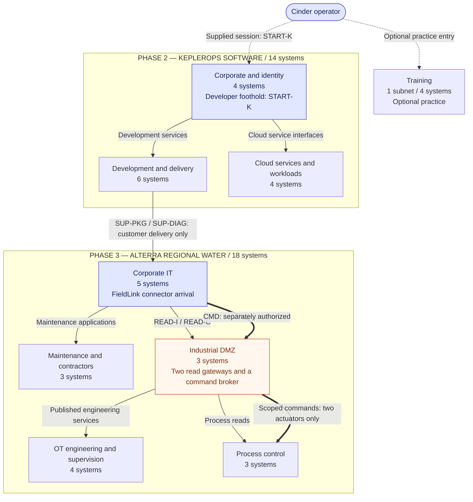

# Cinder Typhoon: logical network architecture

First logical architecture draft. The campaign occupies **nine logical subnets
containing 36 target systems**: four in training, fourteen at KeplerOps, and
eighteen at ARWC. These are the systems and boundaries that exist in the story.
A system may contain several related applications or challenge surfaces; this
inventory makes no decision about deployment instances or hosting.

The drawings follow the [executable access model](model_topology.py). The
[challenge architecture](challenge-architecture.md) and
[dependency ledger](challenge-dependencies.json) retain the progression and
evidence contracts. Individual briefs remain at their existing level of detail.

## Campaign map

Arrows show permitted classes of interaction across boundaries. Each boundary
admits the services named in the detailed views; an arrow between subnets does
not grant unrestricted access to every system in the destination.



Training and the developer starting session are separate entry points. No
training result is required to enter KeplerOps. The supplier/customer boundary
is crossed by an accepted FieldLink package or support diagnostic delivery.
Neither organization becomes a routable extension of the other.

## Detailed drawings

| Drawing | Logical subnets | Target systems | Main connection points |
| --- | ---: | ---: | --- |
| [Training](logical-network/training.md) | 1 | 4 | START-K leads to the separately supplied developer session. |
| [KeplerOps](logical-network/keplerops.md) | 3 | 14 | SUP-PKG and SUP-DIAG both terminate on ARWC's FieldLink connector. |
| [ARWC corporate and maintenance](logical-network/arwc-corporate.md) | 2 | 8 | READ-I, READ-C, and CMD terminate at the industrial DMZ. |
| [ARWC industrial DMZ and OT](logical-network/arwc-ot.md) | 3 | 10 | The two read routes expose engineering and process information; CMD reaches the reservoir and distribution endpoints. |

## Reading the diagrams

- **Subnet enclosures** are logical network boundaries. Each target belongs to
  exactly one enclosure. Cross-boundary interactions use the indicated service
  conduits; there is no implied second network interface on a target.
- **Rectangles** are target systems. Their stable IDs match the Python model.
  **Rounded connection points** and service fan-outs are drawing aids, not
  extra boxes, routers, or challenge targets.
- **Solid arrows** identify service interactions, reads, or artifact delivery.
  Labels describe the permitted use. Direction is the logical interaction or
  delivery direction, not a choice of TCP initiator; replies are implicit.
- **Heavy arrows** identify the separately authorized live command path.
  **Dotted arrows** identify the supplied starting session or an authority
  relationship; they never grant general network transit.
- A connection exists in-world before the player can use it. Earning evidence
  or authority enables its use; a solved challenge does not manufacture a
  network cable. A reachable interface still enforces its own identity and
  object permissions.

## Connection register

These IDs join the drawings. They identify boundaries rather than new systems.

| ID | Source → destination | Permitted interaction | Progression contract |
| --- | --- | --- | --- |
| START-K | Cinder operator → `k-dev` | Supplied developer session | FOOTHOLD; independent of training. |
| SUP-PKG | `k-registry` → `a-connector` | Customer-bound package consumption | A03 admits delivery; K26.2 proves customer execution and earns CORPORATE. |
| SUP-DIAG | `k-support` → `a-connector` | Customer-bound diagnostic delivery | B03 admits delivery; K27.3 proves customer execution and earns CORPORATE. |
| READ-I | `a-connector` → `a-data-bridge` | Work-order/data integration interface | W03.READ plus W09.DATA permit the integration step; W09.4 earns the downstream read scope. |
| READ-C | `a-connector` → `a-contractor-bridge` | Contractor field-service interface | W13.SESSION permits the gateway work; W14.3 earns the downstream read scope. |
| CMD | `a-connector` → `a-control-broker` → `a-reservoir`, `a-distribution` | Scoped maintenance command service | W26.4 or W28.3 earns CONTROL. The issuance interface is usable before CONTROL, after W26.3 or W28.2 respectively. |

READ-I and READ-C are independent routes to the same required OT visibility.
They do not require each other's completion. The two ways to earn CONTROL also
remain independent. Both ordinary supplier entry routes have only Easy/Medium
prerequisites; the main control boundary retains its Hard route and an optional
Expert route.

## Architectural decisions behind the layout

**KeplerOps is a software business with a customer-delivery boundary.** Source,
builds, packages, previews, and support sit together in a delivery subnet.
Corporate identity and cloud authority have separate homes. A developer can
reach their published interfaces without already possessing their privileged
identities. The cloud boundary represents KeplerOps' in-world cloud estate;
it says nothing about the event's hosting provider.

**ARWC's corporate world remains substantial after arrival.** Work orders,
identity, planning data, procurement, and retained archives live outside OT.
The maintenance subnet serves contractor sessions, drawing approval, and
rendering. It is a business workflow boundary, not an alternative open door
into process control.

**The industrial DMZ contains the three crossings that matter.** Integration
and contractor gateways publish bounded engineering services and process
reads. The command broker admits a different authority. An engineering utility
or maintenance workflow can obtain that authority, but merely reaching their
interfaces cannot do so.

**Process knowledge is distributed for a reason.** Corporate planning records,
historian tags, current engineering projects, HMI mode information, and
independent instrument observations describe different parts of the same
reservoir. This supplies the existing evidence joins without putting every
answer on a single control screen. Instrumentation remains outside the command
broker's write scope.

The reservoir and reporting systems expose persisted stage state. Accepted
completion events change that state; there is no continuously running plant
simulation. Earning CONTROL alone does not open the gates. The main release
requires the existing process interpretation, mode, consequence plan, and
completed release action. Optional rehearsals and reporting outcomes remain
separate from that main result.

## Model check

Run:

```sh
PYTHONDONTWRITEBYTECODE=1 python3 cinder-typhoon/design/model_topology.py --self-test
```

The model checks all 240 challenge placements, 1,209 minimal prerequisite
closures, and all 16 combinations of supplier entry, OT read route, mapping
route, and control route. It also rejects thirteen deliberately broken access
or event configurations. The inventories below include every operation that
touches a system, including cross-system steps; those entries are not additional
challenge allocations.

This establishes consistency between the proposed access paths and the
declared dependencies. It does not establish host isolation or the behavior of
an implemented service. In particular, a published engineering interface is
not a general shell, and a system's several challenge surfaces must preserve
their distinct authorities.
