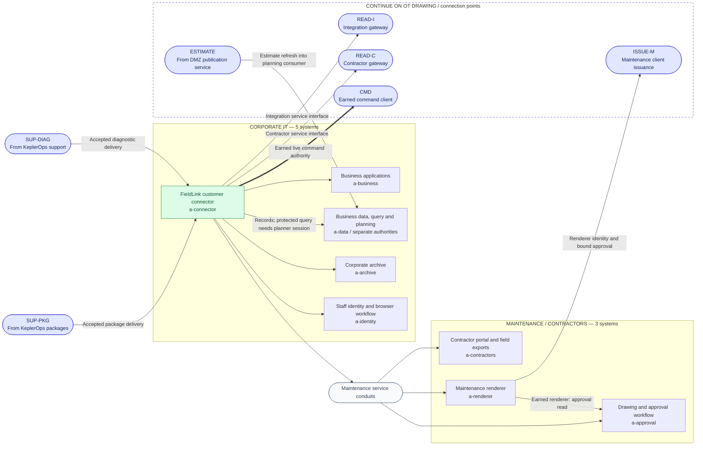

# Phase 3: ARWC corporate and maintenance

[Campaign map](../logical-architecture.md) · [Previous: KeplerOps](keplerops.md) ·
[Continue: industrial DMZ and OT](arwc-ot.md)

Eight systems occupy corporate IT and maintenance subnets. The FieldLink
connector is the common arrival point from both supplier routes. Once the
customer action establishes execution there, corporate applications and
maintenance interfaces become reachable. Their protected functions still
require the identities and evidence in their challenge briefs.

The dashed continuation frame groups drawing connection points, not a third
subnet. READ-I and READ-C terminate on the two DMZ access gateways. ISSUE-M
reaches the maintenance issuer on the command broker from the earned renderer
context; CMD uses that broker after CONTROL is earned. ESTIMATE is the bounded
return feed from the integration gateway's separate publication role.

## Systems and their purpose

| Subnet | System ID | In-world role | Operations with scored work here |
| --- | --- | --- | --- |
| Corporate IT | `a-connector` | ARWC's FieldLink consumer and customer-side ticket context; supplied-delivery landing point. | K26, K27, W01 |
| Corporate IT | `a-business` | Work orders, asset/district associations, report retrieval, and procurement. | W02, W03, W10, W35 |
| Corporate IT | `a-data` | Allocation records, planning queries, retained meter exports, and the business planning consumer. | W07, W09, W11, W29, W33, W34 |
| Corporate IT | `a-archive` | Archive processing and retained contractor, device, and calibration artifacts. | W04, W08, W12, W16 |
| Corporate IT | `a-identity` | Temporary staff onboarding and the planner's identity/browser workflow. | W05, W06 |
| Maintenance / contractors | `a-contractors` | Contractor sessions, maintenance windows, and retained field bags. | W13, W14 |
| Maintenance / contractors | `a-approval` | Drawing versions, cached review context, and maintenance approvals. | W15 |
| Maintenance / contractors | `a-renderer` | Maintenance document rendering and its scoped action relationship. | W26 |

## How the business network leads into OT

The work-order annex and allocation records explain the integration route.
The contractor session and field bag explain the other read route. Either can
reach the published OT surfaces without completing the other. Maintenance
approvals concern authority to act, not ordinary plant visibility.

Corporate retained meter exports are distinct from current process observations.
The former support early W09 work; the latter come through the OT read gateways.
Similarly, W08, W12, and W16 begin with artifacts in `a-archive`, even where the
original material came from engineering or a field device. An artifact's
historical origin does not place its retained copy behind today's OT boundary.

W06.3's planner session is usable from the connector and reaches the protected
query interface for W07. The query worker can execute reconciliation work and
read its log. It cannot write the estimate-consuming planning service merely
because both roles belong to `a-data`. Similarly, the archive helper receives
its own handover access without owning the retained artifact store as a whole.

W26.3 creates an execution position under the maintenance renderer's identity.
That position can read the bound approval and contact ISSUE-M before CONTROL
exists. W26.4 must still establish a client with the correct contractor and
approval binding. The other issuer is reached from the earned engineering
utility context inside OT. Live commands subsequently use CMD.

The business-planning consumer belongs on `a-data`. It consumes estimates
published by OT diagnostics through the integration DMZ service. Controlling
an accepted estimate can change a planning decision; that feed cannot update
raw instrumentation, query-service credentials, or command authority. The
business applications read those planning decisions for their allocation work.
Procurement on `a-business` also gives corporate-only operators a complete
financial objective before reaching OT. See the
[authority register](../logical-authorities.md) for the system boundaries.
