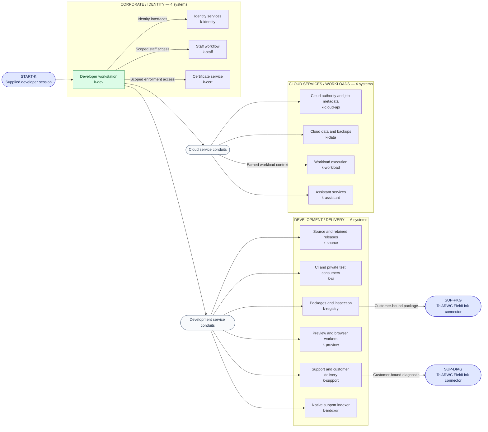

# Phase 2: KeplerOps Software

[Campaign map](../logical-architecture.md) · [Training](training.md) ·
[Next: ARWC corporate](arwc-corporate.md)

Fourteen logical systems occupy three subnets. Cinder starts with a session on
the developer workstation. The workstation can contact the company's
development and cloud interfaces; particular identities, records, execution
contexts, and delivery rights still have to be earned.

The two service-conduit symbols abbreviate the workstation's explicit access
paths. They are neither additional targets nor unrestricted subnet gateways.
The diagram shows access to challenge-facing interfaces, not the company's
entire background service traffic.

## Systems and their purpose

| Subnet | System ID | In-world role | Operations touching this system |
| --- | --- | --- | --- |
| Corporate / identity | `k-dev` | The interrupted developer's workstation and retained predecessor material; initial execution position. | K01, K03 |
| Corporate / identity | `k-staff` | Staff sessions and internal workflow records with narrower access than ordinary development tools. | K18, K19, K20 |
| Corporate / identity | `k-identity` | Company identity and service impersonation interfaces. | K18, K20 |
| Corporate / identity | `k-cert` | Certificate enrollment and the staff identities it can represent. | K19 |
| Development / delivery | `k-source` | Current source, retained releases, and historical signing context. | K11, K28, K29 |
| Development / delivery | `k-ci` | Build execution and private consumer rehearsals, including reference customers. | K02, K06, K09, K20, K29 |
| Development / delivery | `k-registry` | Package publication, entitlement, inspection, and accepted release selection. | K05, K06, K07, K08, K20, K26, K27, K29 |
| Development / delivery | `k-preview` | Release previews and privileged browser workers. | K10, K12 |
| Development / delivery | `k-support` | Customer bindings, support records, and scoped diagnostic delivery. | K17, K18, K25, K27 |
| Development / delivery | `k-indexer` | Native support-bundle indexing and the protected release-exception queue. | K04 |
| Cloud services / workloads | `k-cloud-api` | Cloud authority, job metadata, and scheduling policy. | K13, K14, K30, K31 |
| Cloud services / workloads | `k-workload` | Executing workloads with their own runtime identities. | K16, K31 |
| Cloud services / workloads | `k-data` | Customer data, exports, backups, and protected maintenance history. | K13, K14, K15, K30, K31 |
| Cloud services / workloads | `k-assistant` | Support/developer assistant applications and their scoped tools and data. | K21, K22, K23, K24 |

## Boundaries that must survive the technical design

The support/build branches supply the staff context needed for `k-staff` and
`k-cert`; ordinary workstation possession is insufficient. Workload access has
its own cloud/build alternatives. A cloud API session, permission to change a
workload, and that workload's runtime identity remain different authorities.
Protected source data need not be directly readable merely because its backup
service is reachable.

The package and support branches converge on the **same ARWC customer
connector**, through different delivery contracts. A delivery interface is not
an interactive corporate session. The accepted customer action establishes that
session and opens Phase 3. There is no KeplerOps-to-ARWC domain trust, general
VPN, or direct route to an ARWC read gateway or controller in this draft.

Private release consumers stay on `k-ci`. K29's release rehearsals therefore
do not require an already-owned ARWC network. Likewise, the assistant branch
does not sit in front of either ordinary customer entry route.

For exact preconditions on these paths, use the
[connection register](../logical-architecture.md#connection-register) and
[access model](../model_topology.py); the drawing intentionally carries system
roles rather than a wall of challenge IDs.
