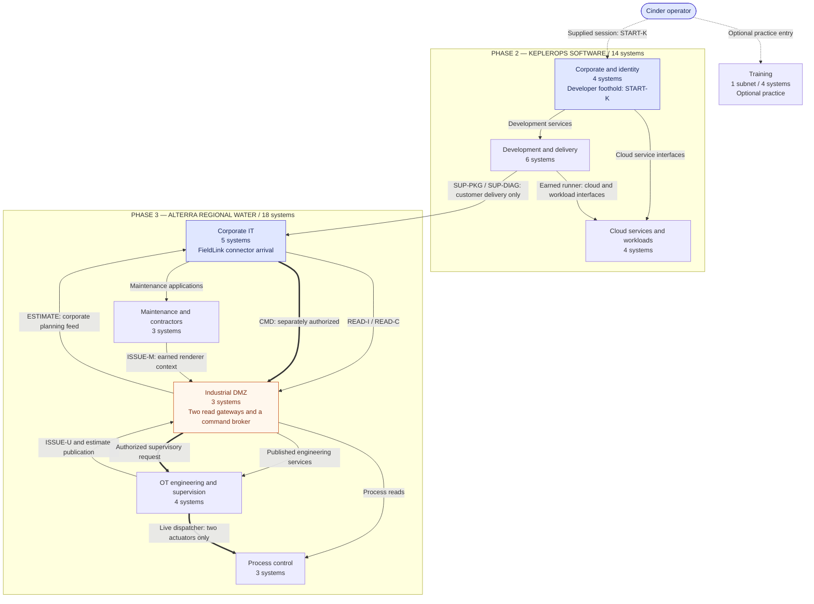

# Cinder Typhoon: logical network architecture

Revised logical architecture. The campaign occupies **nine logical subnets
containing 36 target systems**: four in training, fourteen at KeplerOps, and
eighteen at ARWC. These are the systems and boundaries that exist in the story.
A system may contain several related applications or challenge surfaces; this
inventory makes no decision about deployment instances or hosting. The 36-system
grouping is retained on the explicit authority boundaries in the
[authority and flow register](logical-authorities.md); it remains provisional
if those boundaries cannot be preserved during technical design.

The drawings follow the [executable access model](model_topology.py). The
[challenge architecture](challenge-architecture.md) and
[dependency ledger](challenge-dependencies.json) retain the progression and
evidence contracts. Individual briefs remain at their existing level of detail.

## Campaign map

Arrows show permitted classes of interaction across boundaries. Each boundary
admits the services named in the detailed views; an arrow between subnets does
not grant unrestricted access to every system in the destination.



Training and the developer starting session are separate entry points. No
training result is required to enter KeplerOps. The supplier/customer boundary
is crossed by an accepted FieldLink package or support diagnostic delivery.
Neither organization becomes a routable extension of the other.

## Detailed drawings

| Drawing | Logical subnets | Target systems | Main connection points |
| --- | ---: | ---: | --- |
| [Training](../diagrams/training.md) | 1 | 4 | START-K leads to the separately supplied developer session. |
| [KeplerOps](../diagrams/keplerops.md) | 3 | 14 | SUP-PKG and SUP-DIAG both terminate on ARWC's FieldLink connector. |
| [ARWC corporate and maintenance](../diagrams/arwc-corporate.md) | 2 | 8 | READ-I, READ-C, CMD, and ISSUE-M lead to the DMZ; ESTIMATE returns to corporate planning. |
| [ARWC industrial DMZ and OT](../diagrams/arwc-ot.md) | 3 | 10 | Independent read routes, engineering issuance, supervisory command dispatch, and observation/estimate flows. |

## Reading the diagrams

- **Subnet enclosures** are logical network boundaries. Each target belongs to
  exactly one enclosure. Cross-boundary interactions use the indicated service
  conduits; there is no implied second network interface on a target.
- **Rectangles** are target systems. Their stable IDs match the Python model.
  **Rounded connection points** and service fan-outs are drawing aids, not
  extra boxes, routers, or challenge targets.
- A system can have several **authority domains**. A CI job, release evaluator,
  database job, or live command dispatcher owns only its named scope. Their
  boundaries are recorded explicitly; a box is never an implicit shared root
  account or a pool of all its challenge secrets.
- **Solid arrows** identify service interactions, reads, or artifact delivery.
  Labels describe the permitted use. Direction is the logical interaction or
  delivery direction, not a choice of TCP initiator; replies are implicit.
- **Heavy arrows** identify the separately authorized live command path.
  **Dotted arrows** identify a supplied session or credential handoff; they
  never grant general network transit. Ordinary operational arrows describe
  service-to-service work, and do not make every reached service a relay.
- A connection exists in-world before the player can use it. Earning evidence
  or authority enables its use; a solved challenge does not manufacture a
  network cable. A reachable interface still enforces its own identity and
  object permissions.
- Earned execution creates an origin under the affected service's identity.
  Delegated identities enable scoped service use without implying a shell on
  the issuer. Output manipulation permits its named reporting flow, without
  acquiring the originating system's other identities.

## Connection register

These IDs join the drawings. They identify boundaries rather than new systems.

| ID | Source → destination | Permitted interaction | Progression contract |
| --- | --- | --- | --- |
| START-K | Cinder operator → `k-dev` | Supplied developer session | FOOTHOLD; independent of training. |
| SUP-PKG | `k-registry` → `a-connector` | Customer-bound package consumption and scoped job/result channel | A03 admits delivery; K26.2 proves usable customer execution and earns CORPORATE. |
| SUP-DIAG | `k-support` → `a-connector` | Customer-bound diagnostic delivery and scoped job/result channel | B03 admits delivery; K27.3 proves usable customer execution and earns CORPORATE. |
| READ-I | `a-connector` → `a-data-bridge` | Work-order/data integration interface | W03.READ plus W09.DATA permit the integration step; W09.4 earns the downstream read scope. |
| READ-C | `a-connector` → `a-contractor-bridge` | Contractor field-service interface | W13.SESSION permits the gateway work; W14.3 earns the downstream read scope. |
| ISSUE-M | Earned `a-renderer` worker → `a-control-broker` maintenance issuer | Approval-bound client acquisition | W26.3 supplies the execution position; W26.4 establishes CONTROL. Issuance needs no existing CONTROL. |
| ISSUE-U | Earned `a-engineering` utility → `a-control-broker` engineering issuer | Privilege-sensitive client acquisition | W28.2 supplies the execution position; W28.3 establishes CONTROL. Issuance needs no existing CONTROL. |
| CMD | `a-connector` → `a-control-broker` → `a-hmi` live dispatcher → `a-reservoir`, `a-distribution` | Scoped supervisory command service | The W26.4 or W28.3 client is usable from the existing corporate position. Only the dispatcher commands actuators. |
| ESTIMATE | Accepted `a-diagnostics` output → `a-data-bridge` publication role → `a-data` planning consumer | Bounded estimate feed | W23.3 or W27.3 controls the accepted estimate; W34 must demonstrate the distinct consumer effect. No raw-measurement or command authority follows. |

READ-I and READ-C are independent routes to the same required OT visibility.
They do not require each other's completion. The two ways to earn CONTROL also
remain independent. Both ordinary supplier entry routes have only Easy/Medium
prerequisites; the main control boundary retains its Hard route and an optional
Expert route.

## Architectural decisions behind the layout

**KeplerOps is a software business with a customer-delivery boundary.** Source,
builds, packages, previews, and support sit together in a delivery subnet.
Corporate identity and cloud authority have separate homes. Broad published
interfaces support independent opening work. Earned runner execution opens
authenticated build records and maintenance work; separate cloud identities
provide the alternative paths and the later runtime pivot. Ordinary build,
publication, and private consumer relationships now appear alongside those
access paths. The cloud boundary represents KeplerOps' in-world cloud estate.

**ARWC's corporate world remains substantial after arrival.** Work orders,
identity, planning data, procurement, and retained archives live outside OT.
The maintenance subnet serves contractor sessions, drawing approval, and
rendering. Earned planner authority reaches the protected query interface;
query execution is bounded to reconciliation work. Renderer execution reaches
the maintenance issuer through its approved workflow.

**The industrial DMZ contains the three crossings that matter.** Integration
and contractor gateways publish bounded engineering services and process
reads. The integration system also carries a separately scoped estimate feed
back to corporate planning. Two issuers establish command clients from the
renderer or engineering utility context. The broker passes accepted requests
to the supervisory dispatcher; its command path does not terminate directly
on the actuator subnet.

**Process knowledge is distributed for a reason.** Corporate planning records,
historian tags, current engineering projects, HMI mode information, and
independent instrument observations describe different parts of the same
reservoir. This supplies the existing evidence joins without putting every
answer on a single control screen. Instrumentation remains outside the command
broker's write scope.

The reservoir and reporting systems expose persisted stage state. Accepted
completion events change that state; there is no continuously running plant
simulation. Earning CONTROL alone does not open the gates. The main release
requires the existing process interpretation, mode, consequence plan, and
completed release action. Optional rehearsals and reporting outcomes remain
separate from that main result.

## Model check

Run:

```sh
PYTHONDONTWRITEBYTECODE=1 python3 cinder-typhoon/docs/design/model_topology.py --self-test
```

The model checks all 240 challenge placements, 1,209 minimal prerequisite
closures, and all 16 combinations of supplier entry, OT read route, mapping
route, and control route. It also checks 83 authority domains and 26 contexts,
including scoped execution, delegated identities, and bounded output control.
Twenty-six deliberately broken configurations are rejected, including the
compromised-runner and diagnostic-command bypasses found in review.

Boundary checks combine all compatible optional compromises while withholding
CORPORATE, OT_READ, or CONTROL. Per-context checks use all evidence but retain
only the tested identity, preventing shared evidence from silently granting a
neighbouring identity. Positive witnesses confirm useful pivots, and removing
the supervisory or estimate publication path strands the relevant work.

Inventory operation lists identify scored work placed on a system, including
cross-system steps; ordinary transit and publication do not add allocations.

This establishes the declared routes and authority constraints in the logical
graph. It cannot discover an exploit, credential, or connection absent from
that graph, and does not establish OS isolation or implemented service
behaviour. The authority register is a requirement for the later technical
design, not a claim that deployment isolation has already been achieved.
