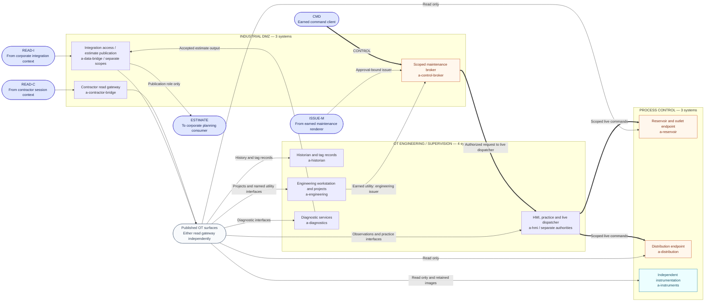
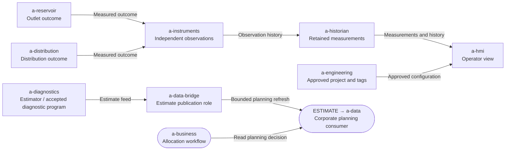
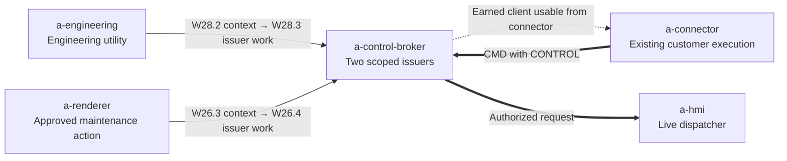

# Phase 3: ARWC industrial DMZ and OT

[Campaign map](../design/logical-architecture.md) ·
[Previous: corporate and maintenance](arwc-corporate.md)

Ten systems occupy three subnets. Two DMZ gateways independently expose a
defined set of engineering services and read-only process observations. A third
DMZ system, the maintenance broker, sends authorized requests to the HMI's
supervisory dispatcher, which commands the two actuator endpoints.

The published-surfaces symbol is a fan-out of allowed service paths, not an
extra gateway. Either read gateway provides the complete required visibility;
the player need not chain them. Reads include request/response access, not
just a static screen. Engineering utilities and diagnostic applications can be
interacted with, but their privileged functions remain separate challenges.
The utility's invocation interface and earned execution context are separate
authorities. The HMI's accessible practice/schedule interface likewise does
not expose its live dispatch authority. See the
[authority register](../design/logical-authorities.md).

### Ordinary process and planning flows

This view reuses the systems above and the corporate planning consumer. It
shows why the process views contain evidence and how diagnostic tampering can
affect business decisions. These are logical data relationships; observations
and outcomes are populated by triggered stages, without a continuous process
simulation.

An observation feed, an accepted estimate, and a live command remain different
channels. Reading the historian never gives the caller the instrument's
publishing identity. The two estimate-producing branches can influence the
planner through ESTIMATE; the native diagnostic vault can only recover its
retained approval history. None acquires the other's authority by sharing
`a-diagnostics`.

## Systems and their purpose

| Subnet | System ID | In-world role | Operations with scored work here |
| --- | --- | --- | --- |
| Industrial DMZ | `a-data-bridge` | Publishes the work-order/data integration view; a separate role carries estimates out to corporate planning. | W09 |
| Industrial DMZ | `a-contractor-bridge` | Publishes the contractor field-service view into OT. | W14 |
| Industrial DMZ | `a-control-broker` | Separate maintenance/engineering issuers; accepts scoped clients and sends authorized requests to the supervisory dispatcher. | W26, W28 |
| OT engineering / supervision | `a-hmi` | Operator view, operating envelope, mode, practice and scheduling; a separate live dispatcher commands actuators. | W17, W25, W29, W30, W33 |
| OT engineering / supervision | `a-historian` | Retained process observations and tag context. | W18, W33 |
| OT engineering / supervision | `a-engineering` | Engineering projects, deployed revision evidence, retained review context, diagnostics programs, and the small privileged utility. | W19, W21, W22, W27, W28, W32 |
| OT engineering / supervision | `a-diagnostics` | Estimation, diagnostic authorization, and native diagnostic services. | W23, W24, W27, W31 |
| Process control | `a-reservoir` | Reservoir/outlet state and accepted release actions. | W30, W33, W34 |
| Process control | `a-distribution` | Distribution state and the second actuator used in deeper scheduling work. | W33 |
| Process control | `a-instruments` | Independent observations, current device evidence, and retained device images. | W17, W18, W20, W21, W25, W29, W30, W33, W34 |

## The command boundary

The command broker recognizes a scoped client. W28's engineering utility and
W26's approved maintenance workflow reach different issuance interfaces from
their earned execution positions. They establish the same command scope,
despite involving different systems and difficulty. This view expands the
service paths and authority handoff; it adds no systems.

Issuance is available before CONTROL, from the relevant compromised service.
The resulting client can be used from the existing customer position through
CMD. The broker delegates only the accepted request to the live dispatcher;
it does not convey its service identity or provide a controller shell. The
[connection register](../design/logical-architecture.md#connection-register) records
these separate transitions.

The HMI's practice and scheduling interfaces remain reachable through the read
route. A proposed schedule or mode exercise is not a live actuator command.
Actual commands cross the broker and supervisory boundaries with earned
authority. That keeps process investigation available before the Hard/Expert
control work.

`a-instruments` has no command edge. A changed planning estimate, historical
review identity, or diagnostic export authorization cannot rewrite its
independent observations or grant CONTROL. W31's optional diagnostic compromise
also supplies no assumed third control route in this draft.

## Where the story concludes

The reservoir endpoint records the accepted release and its bounded effect;
the independent instruments establish what happened. Corporate planning data
establish why the loss matters. The intended result remains replacement-supply
cost and water restrictions.

The state advances through triggered events. Merely acquiring a control client,
opening a dashboard, or preparing a schedule does not open the gates. Optional
scheduling and reporting rehearsals can show different cases without undoing
the main campaign's completed result.
