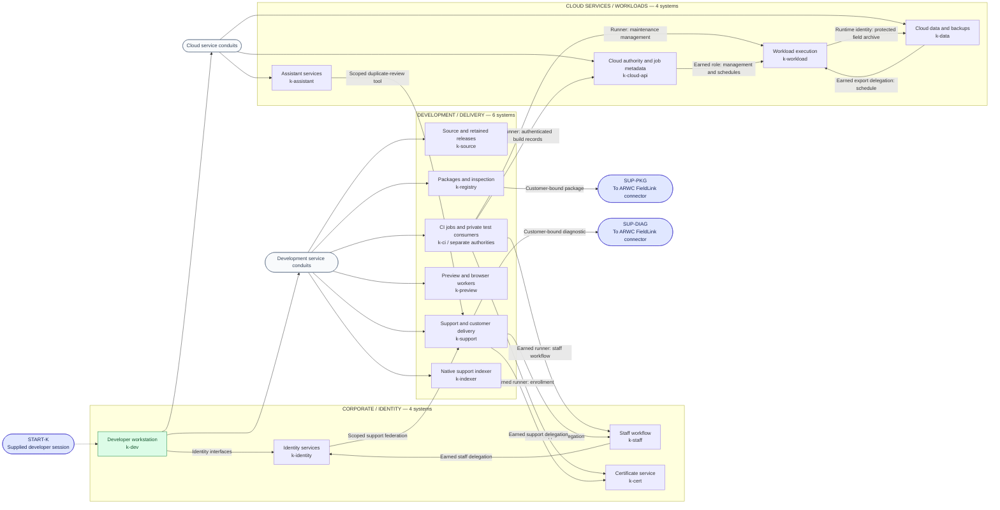
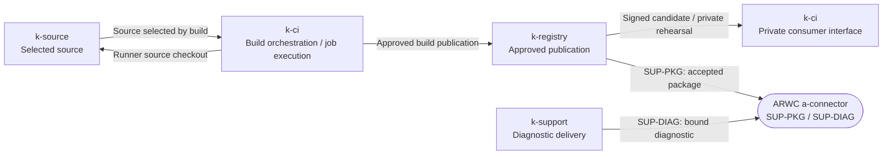

# Phase 2: KeplerOps Software

[Campaign map](../design/logical-architecture.md) · [Training](training.md) ·
[Next: ARWC corporate](arwc-corporate.md)

Fourteen logical systems occupy three subnets. Cinder starts with a session on
the developer workstation. The workstation can contact the company's
development and cloud interfaces; particular identities, records, execution
contexts, and delivery rights still have to be earned.

The two service-conduit symbols abbreviate the workstation's explicit access
paths. The labelled departures from CI, support, cloud, and workload systems
require their named execution or delegated contexts. Contacting an ordinary
interface does not acquire that context or turn the system into a relay.
Delegation denotes scoped service use; it does not imply a shell on its issuer.

### Ordinary delivery relationships

This companion view shows the business connections behind the intrusion. It
reuses systems from the subnet drawing; it adds no targets. The runner and the
release evaluator have different authorities inside `k-ci`.

The release evaluator can read its private reference state; a submitted build
and the compromised job identity cannot. The arrows describe normal service
work. They do not pass the submitting operator's authority along the pipeline.
The [authority register](../design/logical-authorities.md) states the separation and
records the other scoped flows, including backup recovery and assistant tools.

## Systems and their purpose

| Subnet | System ID | In-world role | Operations with scored work here |
| --- | --- | --- | --- |
| Corporate / identity | `k-dev` | The interrupted developer's workstation and retained predecessor material; initial execution position. | K01, K03 |
| Corporate / identity | `k-staff` | Staff sessions and internal workflow records with narrower access than ordinary development tools. | K18, K19, K20 |
| Corporate / identity | `k-identity` | Company identity and service impersonation interfaces. | K18, K20 |
| Corporate / identity | `k-cert` | Certificate enrollment and the staff identities it can represent. | K19 |
| Development / delivery | `k-source` | Current source, protected project handover, retained releases, and historical signing context. | K01, K11, K28, K29 |
| Development / delivery | `k-ci` | Build execution and private consumer rehearsals, including reference customers. | K02, K06, K09, K20, K29 |
| Development / delivery | `k-registry` | Package publication, entitlement, inspection, and accepted release selection. | K05, K06, K07, K08, K20, K26, K27, K29 |
| Development / delivery | `k-preview` | Release previews and privileged browser workers. | K10, K12 |
| Development / delivery | `k-support` | Customer bindings, restored support conversations, and scoped diagnostic delivery. | K01, K17, K18, K25, K27 |
| Development / delivery | `k-indexer` | Native support-bundle indexing and the protected release-exception queue. | K04 |
| Cloud services / workloads | `k-cloud-api` | Cloud authority, job metadata, and scheduling policy. | K13, K14, K30, K31 |
| Cloud services / workloads | `k-workload` | Executing workloads with their own runtime identities. | K16, K31 |
| Cloud services / workloads | `k-data` | Customer data, exports, backups, and protected maintenance history. | K13, K14, K15, K30, K31 |
| Cloud services / workloads | `k-assistant` | Support/developer assistant applications and their scoped tools and data. | K21, K22, K23, K24 |

## Boundaries that must survive the technical design

The support/build branches supply the staff context needed for `k-staff` and
`k-cert`. K09.4 also establishes a runner position that can use authenticated
cloud build records and maintenance interfaces. K13.4 supplies the alternative
limited workload identity; K14.2 supplies the further delegated role. K31.2
then earns the separate runtime position needed at the protected field archive.
K16's scheduled support identity remains a different context.

The backup principal can request recovery through the backup interface. Only
the backup service can read the protected source history. A recovery caller
does not acquire the service's identity or direct source access.

The package and support branches converge on the **same ARWC customer
connector**, through different delivery contracts. A delivery interface is not
an interactive corporate session. The accepted customer action establishes that
session and opens Phase 3. The accepted delivery's existing job/result channel
provides continued, scoped invocation at the connector: the operator can use
the newly running package or diagnostic in that customer context. It supplies
no general supplier-to-customer forwarding. The connector's subsequent local
access is shown on the ARWC drawing; no new independently supplied foothold is
assumed after the delivery challenge.

Private release consumers stay on `k-ci`. K29's release rehearsals therefore
do not require an already-owned ARWC network. Likewise, the assistant branch
does not sit in front of either ordinary customer entry route.

For exact preconditions on these paths, use the
[connection register](../design/logical-architecture.md#connection-register) and
[access model](../design/model_topology.py); the drawing intentionally carries system
roles rather than a wall of challenge IDs.
