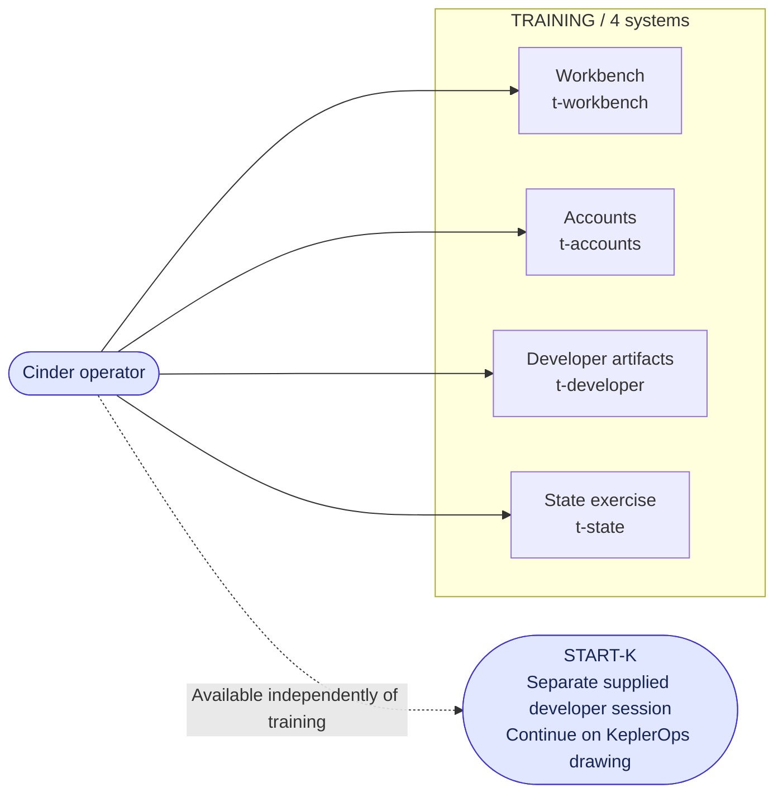

# Phase 1: Cinder Typhoon training

[Campaign map](../design/logical-architecture.md) · [Next: KeplerOps](keplerops.md)

Four independent practice systems occupy one training subnet. Participants can
use any of them and return later. Training does not supply a credential, pivot,
or mandatory flag for the live campaign.

| System ID | In-world role | Operations touching this system |
| --- | --- | --- |
| `t-workbench` | Practice environment for initial tool use and evidence handling. | T01 |
| `t-accounts` | Practice accounts and authorization boundaries. | T02 |
| `t-developer` | Practice software artifacts and developer investigation. | T03 |
| `t-state` | Practice state and outcome interpretation. | T04 |

The operator node represents the participant's access position, not a fifth
training target. START-K joins the developer workstation on the next drawing;
there is no network edge from a training target into KeplerOps.
